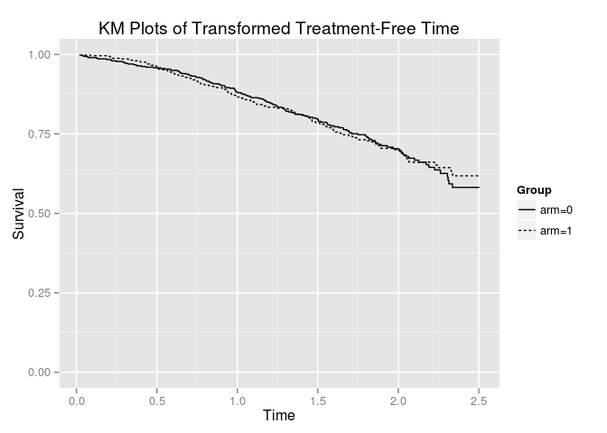

<!-- README.md is generated from README.Rmd. Please edit that file -->
This is an R package that implements the method of Rank Preserving Strucutural Failure Time models to estimate causal effects in failure time models in randomised control trials where participants do not comply with the treatment assigned.

As an example:

``` r
library(rpsftm)
?immdef
fit <- rpsftm(ReCen(progyrs, censyrs)~Instr(imm,1-xoyrs/progyrs),immdef)
summary(fit)
#> rpsftm(formula = ReCen(progyrs, censyrs) ~ Instr(imm, 1 - xoyrs/progyrs), 
#>     data = immdef)
#>       Length Class  Mode   
#> n     2      table  numeric
#> obs   2      -none- numeric
#> exp   2      -none- numeric
#> var   4      -none- numeric
#> chisq 1      -none- numeric
#> 
#> psi: -0.1811218
#> exp(psi): 0.8343337
#> Confidence Interval, psi -0.3497161 0.001993204
#> Confidence Interval, exp(psi)  0.7048882 1.001995
plot(fit)
```



The main function is `rpsftm` which returns an object that has `print`, `summary`, and `plot` S3 methods.

See the vignette rpsftm\_vignette for further details, explanation and examples.
