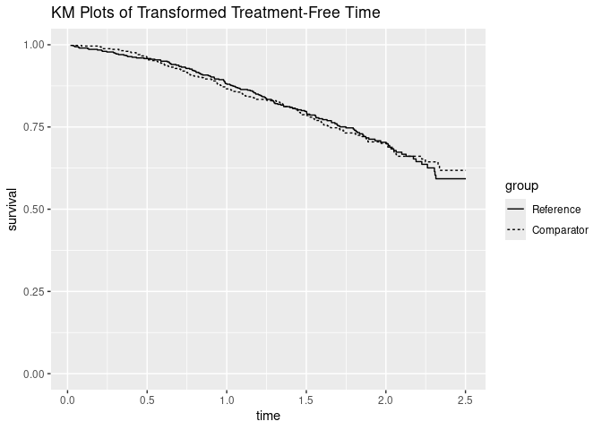

[](https://travis-ci.org/shug0131/rpsftm)
[](https://codecov.io/github/shug0131/rpsftm)
[](https://ci.appveyor.com/project/shug0131/rpsftm)
[](https://cran.r-project.org/package=rpsftm)
[](https://cran.r-project.org/package=rpsftm)
<!-- README.md is generated from README.Rmd. Please edit that file -->

This is an R package that implements the method of Rank Preserving
Structural Failure Time models to estimate causal effects in failure
time models in randomised control trials where participants do not
comply with the treatment assigned.

As an example:

``` r
library(rpsftm)
?immdef
#> starting httpd help server ... done
fit <- rpsftm(Surv(progyrs, prog)~rand(imm,1-xoyrs/progyrs), data = immdef, censor_time = censyrs)
summary(fit)
#>   arm   rx.Min. rx.1st Qu. rx.Median   rx.Mean rx.3rd Qu.   rx.Max.
#> 1   0 0.0000000  0.0000000 0.0000000 0.1574062  0.2547779 0.9770941
#> 2   1 1.0000000  1.0000000 1.0000000 1.0000000  1.0000000 1.0000000
#>         Length Class      Mode   
#> psi        1   -none-     numeric
#> fit       17   survfit    list   
#> CI         2   -none-     numeric
#> Sstar   1000   Surv       numeric
#> rand    2000   rand       numeric
#> ans        5   -none-     list   
#> eval_z     2   data.frame list   
#> n          2   table      numeric
#> obs        2   -none-     numeric
#> exp        2   -none-     numeric
#> var        4   -none-     numeric
#> chisq      1   -none-     numeric
#> call       4   -none-     call   
#> formula    3   terms      call   
#> terms      3   terms      call   
#> 
#> psi: -0.1810871
#> exp(psi): 0.8343627
#> Confidence Interval, psi -0.3496948 0.002042503
#> Confidence Interval, exp(psi)  0.7049032 1.002045
plot(fit)
```

<!-- -->

The main function is `rpsftm` which returns an object that has `print`,
`summary`, and `plot` S3 methods.

See the vignette rpsftm\_vignette for further details, explanation and
examples.
