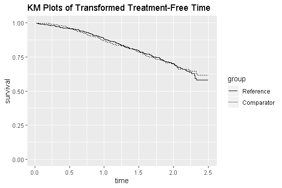

# rpsftm: rank-preserving structural failure time models for survival data
Simon Bond, Annabel Allison  
`r Sys.Date()`  


## Summary 

The package `rpsftm` provides functions to fit a rank preserving structural failure time model to a two-arm clinical trial with survival outcomes. 


## Introduction

The rank preserving structural failure time model (RPSFTM) is a method used to adjust for treatment switching in trials with survival outcomes. Treatment switching occurs when patients switch from their randomised arm to the other treatment during the study. The RPSFTM is due to _Robins and Tsiatis (1991)_ and has been developed by _White et al. (1997, 1999)_. 

The method is randomisation based and uses only the randomised treatment group, observed event times and treatment history in order to estimate a causal treatment effect. The treatment effect, $\psi$, is estimated by balancing counter-factual event times (i.e. the time that would be observed if no treatment were received) between treatment groups. A g-estimation procedure is used to find the value of $\psi$ such that a test statistic $Z(\psi) = 0$. Recensoring must be performed as censoring becomes informative on the counter-factual time scale.  


## Syntax

`rpsftm(formula, data, censor_time, subset, na.action, test=survdiff, low_psi=-1, hi_psi=1, alpha=0.05, treat_modifier=1, autoswitch=TRUE, n_eval_z=100, ...)`  

<br>
`rpsftm` is the main function used for estimating causal parameters under the RPSFTM. The arguments are as follows:

* `formula` a formula with a minimal structure of `Surv(time, status) ~ rand(arm, rx)` where 
 
    * `arm` is the randomised treatment arm, and 
    * `rx` is the proportion of time spent on treatment, taking values in [0, 1].

    Further terms can be added to the right hand side to adjust for covariates. 
* `data` an optional data frame containing the variables.
* `censor_time` the time at which censoring would, or has occurred. This is provided for all observations unlike standard Kaplan-Meier or Cox regression where it is only given for censored observations. If no value is given then recensoring is not applied.
* `subset` an expression indicating which subset of the rows of data should be used in the fit. This can be a logical vector, a numeric vector indicating which observation numbers are to be included, or a character vector of row names to be included. All observations are included by default.
* `na.action` a missing-data filter function. This is applied to the `model.frame` after any subset argument has been used. Default is `options()$na.action`.
* `test` one of `survdiff`, `coxph` or `survreg`. Describes the test to be used in the estimating equation. Default is `survdiff`.
* `low_psi` the lower limit of the range to search for the causal parameter. Default is -1.
* `hi_psi` the upper limit of the range to search for the causal parameter. Default is 1. 
* `alpha` the significance level used to calculate the confidence intervals. Default is 0.05. 
* `treat_modifier` an optional parameter that $\psi$ is multiplied by on an individual observation level to give differing impact to treatment. Default is 1.
* `autoswitch` a logical to autodetect cases of no switching. Default is TRUE. If all observations in an arm have perfect compliance then recensoring is not applied in that arm. If FALSE then recensoring is applied regardless of perfect compliance.
* `n_eval_z` The number of points between `hi_psi` and `low_psi` at which to evaluate the Z-statistics in the estimating equation. Default is 100.


## Example 

The `rpsftm` function will be illustrated using a simulated dataset `immdef` based on a randomized controlled trial; see _Concorde Coordinating Committee (1994)_. The trial compares two policies (immediate or deferred treatment) of zidovudine treatment in symptom free individuals infected with HIV. The immediate treatment arm received treatment at randomisation whilst the deferred arm received treatment either at onset of AIDS related complex or AIDs or development of persistently low CD4 count.
The primary endpoint was time to progression to AIDS or CDC group IV disease, or death. 

### Data

The `immdef` data frame has 1000 observations and 8 variables: 

* __id__ participant ID number
* __def__ indicator that the participant was assigned to the Deferred treatment arm
* __imm__ indicator that the participant was assigned to the Immediate treatment arm
* __censyrs__ censoring time, corresponding to the close of study minus the time of entry for each participant
* __xo__ an indicator that crossover occurred
* __xoyrs__ the time at which crossover happened, or 0 for participants in the Immediate arm
* __prog__ an indicator of disease progression (1), or censoring (0)
* __entry__ the time of entry into the study

The first six entries are:


```r
library(rpsftm)
head(immdef)
#>   id def imm censyrs xo    xoyrs prog  progyrs entry
#> 1  1   0   1       3  0 0.000000    0 3.000000     0
#> 2  2   1   0       3  1 2.652797    0 3.000000     0
#> 3  3   0   1       3  0 0.000000    1 1.737838     0
#> 4  4   0   1       3  0 0.000000    1 2.166291     0
#> 5  5   1   0       3  1 2.122100    1 2.884646     0
#> 6  6   1   0       3  1 0.557392    0 3.000000     0
```

For example, subject 2 was randomised to the deferred arm, started treatment at 2.65 years and was censored at 3 years (the end of the study). Subject 3 was randomised to the immediate treatment arm and progressed (observed the event) at 1.74 years. Subject 5 was randomised to the deferred treatment arm, started treatment at 2.12 years and progressed at 2.88 years. The trial lasted 3 years with staggered entry over the first 1.5 years. The variable __censyrs__ gives the time from entry to the end of the trial. The table below shows summary statistics for the `immdef` data:


```r
library(tableone)
vars       <- c("def", "imm", "censyrs", "xo", "xoyrs", "prog", "progyrs", "entry")
factorVars <- c("def", "imm", "xo", "prog") 
CreateTableOne(vars=vars, data=immdef, factorVars=factorVars, includeNA=FALSE, test=FALSE)
#>                      
#>                       Overall     
#>   n                   1000        
#>   def = 1 (%)          500 (50.0) 
#>   imm = 1 (%)          500 (50.0) 
#>   censyrs (mean (sd)) 2.25 (0.45) 
#>   xo = 1 (%)           189 (18.9) 
#>   xoyrs (mean (sd))   0.78 (0.93) 
#>   prog = 1 (%)         312 (31.2) 
#>   progyrs (mean (sd)) 1.93 (0.66) 
#>   entry (mean (sd))   0.75 (0.45)
```


## Fitting the RPSFTM

We now show how to use `rpsftm` with the `immdef` data. First, a variable __rx__ for the proportion of time spent on treatment must be created:


```r
rx <- with(immdef, 1 - xoyrs/progyrs)
```

This sets __rx__ to 1 in the immediate treatment arm (since no patients could switch to the deferred arm), 0 in the deferred arm patients that did not receive treatment and __1 - xoyrs/progyrs__ in the deferred arm patients that did receive treatment. Using the default options, the fitted model is


```r
rpsftm_fit_lr <- rpsftm(formula=Surv(progyrs, prog) ~ rand(imm, rx), 
                        data=immdef, 
                        censor_time=censyrs)
```

The above formula fits a RPSFTM where `progyrs` is the observed event time, `prog` is the indicator of disease progression, `imm` is the randomised treatment group indicator, `rx` is the proportion of time spent on treatment and `censyrs` is the censoring time. The log rank test is used in finding the point estimate of $\psi$, $\hat{\psi}$. Recensoring is performed since the `censor_time` parameter is specified; if not specified then recensoring would not be performed. After finding $\hat{\psi}$, `rpsftm` refits the model at $\hat{\psi}$ and produces a `survdiff` object of the counter-factual event times to be used in plotting Kaplan-Meier curves. The function returns 

* __psi__ the estimated parameter
* __fit__ a `survdiff` object to produce Kaplan-Meier curves of the estimated        counter-factual event times in each treatment arm using `plot()`
* __formula__ a formula representing any adjustments, strata or clusters used 
* __regression__ the survival regression object at __psi__
* __Sstar__ the (possibly) recensored `Surv()` data using __psi__ 
* __ans__ the object returned from `uniroot` used to solve the estimating equation
* __CI__ a vector of the confidence interval around __psi__
* __call__ the R call object
* __eval_z__ a data frame giving values of the Z-statistics at different values of __psi__
 
The point estimate and 95% confidence interval can be returned using `rpsftm_fit_lr$psi` and `rpsftm_fit_lr$CI` which gives $\hat{\psi} = -0.181 (-0.35, 0.00199)$. The function `plot()` produces Kaplan-Meier curves of the counter-factual event times in each group and can be used to check that the distributions are indeed the same at $\hat{\psi}$.


```r
plot(rpsftm_fit_lr)
#> Warning in structure(NULL, class = "waiver"): Calling 'structure(NULL, *)' is deprecated, as NULL cannot have attributes.
#>   Consider 'structure(list(), *)' instead.

#> Warning in structure(NULL, class = "waiver"): Calling 'structure(NULL, *)' is deprecated, as NULL cannot have attributes.
#>   Consider 'structure(list(), *)' instead.

#> Warning in structure(NULL, class = "waiver"): Calling 'structure(NULL, *)' is deprecated, as NULL cannot have attributes.
#>   Consider 'structure(list(), *)' instead.

#> Warning in structure(NULL, class = "waiver"): Calling 'structure(NULL, *)' is deprecated, as NULL cannot have attributes.
#>   Consider 'structure(list(), *)' instead.

#> Warning in structure(NULL, class = "waiver"): Calling 'structure(NULL, *)' is deprecated, as NULL cannot have attributes.
#>   Consider 'structure(list(), *)' instead.

#> Warning in structure(NULL, class = "waiver"): Calling 'structure(NULL, *)' is deprecated, as NULL cannot have attributes.
#>   Consider 'structure(list(), *)' instead.

#> Warning in structure(NULL, class = "waiver"): Calling 'structure(NULL, *)' is deprecated, as NULL cannot have attributes.
#>   Consider 'structure(list(), *)' instead.

#> Warning in structure(NULL, class = "waiver"): Calling 'structure(NULL, *)' is deprecated, as NULL cannot have attributes.
#>   Consider 'structure(list(), *)' instead.

#> Warning in structure(NULL, class = "waiver"): Calling 'structure(NULL, *)' is deprecated, as NULL cannot have attributes.
#>   Consider 'structure(list(), *)' instead.

#> Warning in structure(NULL, class = "waiver"): Calling 'structure(NULL, *)' is deprecated, as NULL cannot have attributes.
#>   Consider 'structure(list(), *)' instead.

#> Warning in structure(NULL, class = "waiver"): Calling 'structure(NULL, *)' is deprecated, as NULL cannot have attributes.
#>   Consider 'structure(list(), *)' instead.

#> Warning in structure(NULL, class = "waiver"): Calling 'structure(NULL, *)' is deprecated, as NULL cannot have attributes.
#>   Consider 'structure(list(), *)' instead.

#> Warning in structure(NULL, class = "waiver"): Calling 'structure(NULL, *)' is deprecated, as NULL cannot have attributes.
#>   Consider 'structure(list(), *)' instead.

#> Warning in structure(NULL, class = "waiver"): Calling 'structure(NULL, *)' is deprecated, as NULL cannot have attributes.
#>   Consider 'structure(list(), *)' instead.

#> Warning in structure(NULL, class = "waiver"): Calling 'structure(NULL, *)' is deprecated, as NULL cannot have attributes.
#>   Consider 'structure(list(), *)' instead.

#> Warning in structure(NULL, class = "waiver"): Calling 'structure(NULL, *)' is deprecated, as NULL cannot have attributes.
#>   Consider 'structure(list(), *)' instead.

#> Warning in structure(NULL, class = "waiver"): Calling 'structure(NULL, *)' is deprecated, as NULL cannot have attributes.
#>   Consider 'structure(list(), *)' instead.

#> Warning in structure(NULL, class = "waiver"): Calling 'structure(NULL, *)' is deprecated, as NULL cannot have attributes.
#>   Consider 'structure(list(), *)' instead.

#> Warning in structure(NULL, class = "waiver"): Calling 'structure(NULL, *)' is deprecated, as NULL cannot have attributes.
#>   Consider 'structure(list(), *)' instead.

#> Warning in structure(NULL, class = "waiver"): Calling 'structure(NULL, *)' is deprecated, as NULL cannot have attributes.
#>   Consider 'structure(list(), *)' instead.
```

<!-- -->


<!-- COXPH-->
We now provide examples of using the Cox regression model and the Weibull model in place of the log rank test. To use the Wald test from a Cox regression model, we specify `test=coxph` in the function parameters. Covariates can also be included in the estimation procedure by adding them to the right hand side of the formula. For example, baseline covariates that are included in the intention-to-treat analysis may also be incorporated into the estimation procedure of the RPSFTM. In the following example we add entry time as a covariate and use `summary()` to find the value of $\hat{\psi}$ and its 95% confidence interval:


```r
rpsftm_fit_cph <- rpsftm(formula=Surv(progyrs, prog) ~ rand(imm, rx) + entry, 
                         data=immdef, 
                         censor_time=censyrs,
                         test=coxph)
summary(rpsftm_fit_cph)
#> rpsftm(formula = Surv(progyrs, prog) ~ rand(imm, rx) + entry, 
#>     data = immdef, censor_time = censyrs, test = coxph)
#>   n= 1000, number of events= 286 
#> 
#>         coef exp(coef) se(coef)     z Pr(>|z|)
#> entry 0.1235    1.1315   0.1487 0.831    0.406
#> 
#>       exp(coef) exp(-coef) lower .95 upper .95
#> entry     1.131     0.8838    0.8454     1.514
#> 
#> Concordance= 0.514  (se = 0.018 )
#> Rsquare= 0.001   (max possible= 0.976 )
#> 
#> psi: -0.1811515
#> exp(psi): 0.834309
#> Confidence Interval, psi -0.3497117 0.00330558
#> Confidence Interval, exp(psi)  0.7048913 1.003311
```

From the output we get $\hat{\psi} = -0.181 (-0.35, 0.00331)$. Again, we can plot the Kaplan-Meier curves of the counter-factual event times in each group:


```r
plot(rpsftm_fit_cph)
#> Warning in structure(NULL, class = "waiver"): Calling 'structure(NULL, *)' is deprecated, as NULL cannot have attributes.
#>   Consider 'structure(list(), *)' instead.

#> Warning in structure(NULL, class = "waiver"): Calling 'structure(NULL, *)' is deprecated, as NULL cannot have attributes.
#>   Consider 'structure(list(), *)' instead.

#> Warning in structure(NULL, class = "waiver"): Calling 'structure(NULL, *)' is deprecated, as NULL cannot have attributes.
#>   Consider 'structure(list(), *)' instead.

#> Warning in structure(NULL, class = "waiver"): Calling 'structure(NULL, *)' is deprecated, as NULL cannot have attributes.
#>   Consider 'structure(list(), *)' instead.

#> Warning in structure(NULL, class = "waiver"): Calling 'structure(NULL, *)' is deprecated, as NULL cannot have attributes.
#>   Consider 'structure(list(), *)' instead.

#> Warning in structure(NULL, class = "waiver"): Calling 'structure(NULL, *)' is deprecated, as NULL cannot have attributes.
#>   Consider 'structure(list(), *)' instead.

#> Warning in structure(NULL, class = "waiver"): Calling 'structure(NULL, *)' is deprecated, as NULL cannot have attributes.
#>   Consider 'structure(list(), *)' instead.

#> Warning in structure(NULL, class = "waiver"): Calling 'structure(NULL, *)' is deprecated, as NULL cannot have attributes.
#>   Consider 'structure(list(), *)' instead.

#> Warning in structure(NULL, class = "waiver"): Calling 'structure(NULL, *)' is deprecated, as NULL cannot have attributes.
#>   Consider 'structure(list(), *)' instead.

#> Warning in structure(NULL, class = "waiver"): Calling 'structure(NULL, *)' is deprecated, as NULL cannot have attributes.
#>   Consider 'structure(list(), *)' instead.

#> Warning in structure(NULL, class = "waiver"): Calling 'structure(NULL, *)' is deprecated, as NULL cannot have attributes.
#>   Consider 'structure(list(), *)' instead.

#> Warning in structure(NULL, class = "waiver"): Calling 'structure(NULL, *)' is deprecated, as NULL cannot have attributes.
#>   Consider 'structure(list(), *)' instead.

#> Warning in structure(NULL, class = "waiver"): Calling 'structure(NULL, *)' is deprecated, as NULL cannot have attributes.
#>   Consider 'structure(list(), *)' instead.

#> Warning in structure(NULL, class = "waiver"): Calling 'structure(NULL, *)' is deprecated, as NULL cannot have attributes.
#>   Consider 'structure(list(), *)' instead.

#> Warning in structure(NULL, class = "waiver"): Calling 'structure(NULL, *)' is deprecated, as NULL cannot have attributes.
#>   Consider 'structure(list(), *)' instead.

#> Warning in structure(NULL, class = "waiver"): Calling 'structure(NULL, *)' is deprecated, as NULL cannot have attributes.
#>   Consider 'structure(list(), *)' instead.

#> Warning in structure(NULL, class = "waiver"): Calling 'structure(NULL, *)' is deprecated, as NULL cannot have attributes.
#>   Consider 'structure(list(), *)' instead.

#> Warning in structure(NULL, class = "waiver"): Calling 'structure(NULL, *)' is deprecated, as NULL cannot have attributes.
#>   Consider 'structure(list(), *)' instead.

#> Warning in structure(NULL, class = "waiver"): Calling 'structure(NULL, *)' is deprecated, as NULL cannot have attributes.
#>   Consider 'structure(list(), *)' instead.

#> Warning in structure(NULL, class = "waiver"): Calling 'structure(NULL, *)' is deprecated, as NULL cannot have attributes.
#>   Consider 'structure(list(), *)' instead.
```

<!-- -->

<!--SURVREG-->
Similary, for the Weibull model we have:


```r
rpsftm_fit_wb <- rpsftm(formula=Surv(progyrs, prog) ~ rand(imm, rx) + entry, 
                        data=immdef, 
                        censor_time=censyrs,
                        test=survreg)
summary(rpsftm_fit_wb)
#> rpsftm(formula = Surv(progyrs, prog) ~ rand(imm, rx) + entry, 
#>     data = immdef, censor_time = censyrs, test = survreg)
#> 
#> Call:
#> NULL
#>               Value Std. Error      z        p
#> (Intercept)  1.3881     0.0857 16.196 5.35e-59
#> entry       -0.0582     0.0906 -0.642 5.21e-01
#> Log(scale)  -0.4176     0.0568 -7.349 1.99e-13
#> 
#> Scale= 0.659 
#> 
#> Weibull distribution
#> Loglik(model)= -759.7   Loglik(intercept only)= -760
#> Number of Newton-Raphson Iterations: 6 
#> n= 1000 
#> 
#> 
#> psi: -0.181231
#> exp(psi): 0.8342427
#> Confidence Interval, psi -0.3501386 0.005173062
#> Confidence Interval, exp(psi)  0.7045904 1.005186
```


```r
plot(rpsftm_fit_wb)
#> Warning in structure(NULL, class = "waiver"): Calling 'structure(NULL, *)' is deprecated, as NULL cannot have attributes.
#>   Consider 'structure(list(), *)' instead.

#> Warning in structure(NULL, class = "waiver"): Calling 'structure(NULL, *)' is deprecated, as NULL cannot have attributes.
#>   Consider 'structure(list(), *)' instead.

#> Warning in structure(NULL, class = "waiver"): Calling 'structure(NULL, *)' is deprecated, as NULL cannot have attributes.
#>   Consider 'structure(list(), *)' instead.

#> Warning in structure(NULL, class = "waiver"): Calling 'structure(NULL, *)' is deprecated, as NULL cannot have attributes.
#>   Consider 'structure(list(), *)' instead.

#> Warning in structure(NULL, class = "waiver"): Calling 'structure(NULL, *)' is deprecated, as NULL cannot have attributes.
#>   Consider 'structure(list(), *)' instead.

#> Warning in structure(NULL, class = "waiver"): Calling 'structure(NULL, *)' is deprecated, as NULL cannot have attributes.
#>   Consider 'structure(list(), *)' instead.

#> Warning in structure(NULL, class = "waiver"): Calling 'structure(NULL, *)' is deprecated, as NULL cannot have attributes.
#>   Consider 'structure(list(), *)' instead.

#> Warning in structure(NULL, class = "waiver"): Calling 'structure(NULL, *)' is deprecated, as NULL cannot have attributes.
#>   Consider 'structure(list(), *)' instead.

#> Warning in structure(NULL, class = "waiver"): Calling 'structure(NULL, *)' is deprecated, as NULL cannot have attributes.
#>   Consider 'structure(list(), *)' instead.

#> Warning in structure(NULL, class = "waiver"): Calling 'structure(NULL, *)' is deprecated, as NULL cannot have attributes.
#>   Consider 'structure(list(), *)' instead.

#> Warning in structure(NULL, class = "waiver"): Calling 'structure(NULL, *)' is deprecated, as NULL cannot have attributes.
#>   Consider 'structure(list(), *)' instead.

#> Warning in structure(NULL, class = "waiver"): Calling 'structure(NULL, *)' is deprecated, as NULL cannot have attributes.
#>   Consider 'structure(list(), *)' instead.

#> Warning in structure(NULL, class = "waiver"): Calling 'structure(NULL, *)' is deprecated, as NULL cannot have attributes.
#>   Consider 'structure(list(), *)' instead.

#> Warning in structure(NULL, class = "waiver"): Calling 'structure(NULL, *)' is deprecated, as NULL cannot have attributes.
#>   Consider 'structure(list(), *)' instead.

#> Warning in structure(NULL, class = "waiver"): Calling 'structure(NULL, *)' is deprecated, as NULL cannot have attributes.
#>   Consider 'structure(list(), *)' instead.

#> Warning in structure(NULL, class = "waiver"): Calling 'structure(NULL, *)' is deprecated, as NULL cannot have attributes.
#>   Consider 'structure(list(), *)' instead.

#> Warning in structure(NULL, class = "waiver"): Calling 'structure(NULL, *)' is deprecated, as NULL cannot have attributes.
#>   Consider 'structure(list(), *)' instead.

#> Warning in structure(NULL, class = "waiver"): Calling 'structure(NULL, *)' is deprecated, as NULL cannot have attributes.
#>   Consider 'structure(list(), *)' instead.

#> Warning in structure(NULL, class = "waiver"): Calling 'structure(NULL, *)' is deprecated, as NULL cannot have attributes.
#>   Consider 'structure(list(), *)' instead.

#> Warning in structure(NULL, class = "waiver"): Calling 'structure(NULL, *)' is deprecated, as NULL cannot have attributes.
#>   Consider 'structure(list(), *)' instead.
```

<!-- -->

The output shows that $\hat{\psi} = -0.181 (-0.35, 0.00517)$. In all three cases, the point estimate and 95% confidence interval of $\psi$ are similar.


### Checking the search interval   
There are two instances where `rpsftm` will produce warning messages due to the search interval. The function first evaluates $Z(\psi)$ at $\psi =$ `low_psi`, `hi_psi` and will produce a warning message if $Z(\psi)$ is the same sign at these two points.


```
#> Warning in rpsftm(formula = Surv(progyrs, prog) ~ rand(imm, rx), data = immdef, : 
#> The starting interval (1, 2) to search for a solution for psi
#> gives values of the same sign (-8.95, -12.3).
#> Try a wider interval. plot(obj$eval_z, type="s"), where obj is the output of rpsftm()
#> Warning in rpsftm(formula = Surv(progyrs, prog) ~ rand(imm, rx), data =
#> immdef, : Evaluation of the estimated values of psi failed. It is set to NA
#> Warning in rpsftm(formula = Surv(progyrs, prog) ~ rand(imm, rx), data =
#> immdef, : Evaluation of a limit of the Confidence Interval failed. It is
#> set to NA

#> Warning in rpsftm(formula = Surv(progyrs, prog) ~ rand(imm, rx), data =
#> immdef, : Evaluation of a limit of the Confidence Interval failed. It is
#> set to NA
#> rpsftm(formula = Surv(progyrs, prog) ~ rand(imm, rx), data = immdef, 
#>     censor_time = censyrs, low_psi = 1, hi_psi = 2)
#> NULL
#> 
#> psi: NA
#> exp(psi): NA
```

This suggests widening the search interval via trial and error until the values of $Z(\psi)$ at `low_psi` and `hi_psi` are of opposite sign. The second warning message occurs when `uniroot` , the function used to search the interval (`low_psi`, `hi_psi`) for $\hat{\psi}$ and its 95\% confidence interval, fails to find any one of these. It will set the value to NA and produce the following warning message 


```r
rpsftm_fit <- rpsftm(formula=Surv(progyrs, prog) ~ rand(imm, rx),
                     data=immdef, 
                     censor_time=censyrs,
                     low_psi=-1, 
                     hi_psi=-0.1)
#> Warning in rpsftm(formula = Surv(progyrs, prog) ~ rand(imm, rx), data =
#> immdef, : Evaluation of a limit of the Confidence Interval failed. It is
#> set to NA
```

Investigation of a plot of $Z(\psi)$ against $\psi$ (example shown below) for a range of values of $\psi$ could show why the functions fails to find a root. The fitted object, `rpsftm_fit`, returns a data frame (`rpsftm_fit$eval_z`) with values of the Z-statistic evaluated at 100 points between the limits of the search interval. It is therefore straightforward to plot $Z(\psi)$ against $\psi$


```r
plot(rpsftm_fit$eval_z, type="s", ylim=c(-2, 6))
abline(h=qnorm(c(0.025, 0.5, 0.975)))
abline(v=rpsftm_fit$psi)
abline(v=rpsftm_fit$CI)
```

<!-- -->

In this case, we see that the search interval used in `rpsftm` was not wide enough to find the upper confidence limit. The plot can also be used to check for multiple roots as `uniroot` will only return one root. 

## Methods 

### RPSFTM assumptions

Let $T_i = T_i^{off} + T_i^{on}$ be the observed event time for subject $i$, where $T_i^{off}$ and $T_i^{on}$ are the time that the patient spent off and on treatment, respectively. The $T_i$ are related to the counter-factual or treatment-free event times $U_i$ by the causal model
\[
U_i = T_i^{off} + T_i^{on}\exp(\psi_0)
\]
where $\exp(-\psi_0)$ is the acceleration factor associated with treatment and $\psi_0$ is the true causal parameter. 

To estimate $\psi$ we assume that the $U_i$ are independent of randomised treatment group $R$, i.e. if the groups are similar with respect to all other characteristics except treatment, the average event times should be the same in each group if no individual were treated. A g-estimation procedure is used to find the value of $\psi$ such that $U$ is independent of $R$. For each value of $\psi$ considered, the hypothesis $\psi_0 = \psi$ is tested by computing $U_i(\psi)$ and calculating $Z(\psi)$ as the test statistic. This is usually the same test statistic as for the intention-to-treat analysis. In the `rpsftm` function, the test options are log rank (default), Cox, and  Weibull. For the parametric Weibull test, the point estimate ($\hat{\psi}$) is the value of $\psi$ for which $Z(\psi) = 0$. For the non-parametric tests (log rank, Cox), $\hat{\psi}$ is the value of $\psi$ for which $Z(\psi)$ crosses 0, since $Z(\psi)$ is a step function. Confidence intervals are similarly found with the $100(1-\alpha)\%$ confidence interval being the set $\{\psi: |Z(\psi)| < z_{1-\alpha/2}\}$, where $z_{1-\alpha/2}$ is the $1-\alpha/2$ percentile of the standard normal distribution.

As well as assuming that the only difference between randomised groups is the treatment received, the RPSFTM also assumes a 'common treatment effect'. The common treatment effect assumption states that the treatment effect is the same for all individuals (with respect to time spent on treatment) regardless of when treatment is received. 

### Recensoring

The censoring indicators of the observed event times are initially carried over to the counter-factual event times. However, the uninformative censoring on the $T_i$ scale may be informative on the $U_i$ scale. Suppose we have two individuals with the same $U_i$, one of whom receives the superior treatment. The individual receiving the superior treatment has their $U_i$ extended so that they are censored whilst the other individual may observe the event. Therefore, on the $U_i$ scale, censoring is informative with respect to treatment group. To overcome this problem, the counter-factual event times are recensored by the minimum $U_i$ that could have been observed for each individual across their possible treatment changes. 

Let $C_i$ be the potential censoring time for an individual $i$. An individual is then recensored at the minimum possible censoring time:
\[
D_i^*(\psi) = min(C_i, C_i\exp(\psi)). 
\]
If $D_i^*(\psi) < U_i$, then $U_i$ is replaced by $D_i^*$ and the censoring indicator is replaced by 0. For treatment arms where switching does not occur, there can be no informative censoring and so recensoring is not applied.   

## Sensitivity analysis

As previously mentioned, the RPSFTM has two assumptions:

1. The only difference between randomised groups is the treatment received.
2. The treatment effect is the same for all individuals regardless of when treatment is received.

Whilst the first assumption is plausible in a randomised controlled trial, the latter may be unlikely to hold if, for example, control group patients can only switch at disease progression then the treatment benefit may be different in these individuals compared to those randomised to the experimental treatment. The `rpsftm` function allows for investigation of deviations from the common treatment effect assumption by featuring a treatment effect modifier variable which means the treatment effect can be varied across individuals. This is achieved by multiplying $\psi$ by some factor $k_i$: 
\[
U_i = T_i^{off} + T_i^{on}\exp(k_i\psi).
\]
For example, we can investigate what would happen to the estimate of $\psi$ if the treatment effect in switchers was half of that in the experimental group by setting $k_i = 1$ for patients in the experimental group and $k_i = 0.5$ for patients in the control group.


```r

weight <- with(immdef, ifelse(imm==1, 1, 0.5))
rpsftm( Surv( progyrs, prog) ~ rand( imm, rx), data = immdef, censor_time = censyrs,
        treat_modifier = weight
        )
#> rpsftm(formula = Surv(progyrs, prog) ~ rand(imm, rx), data = immdef, 
#>     censor_time = censyrs, treat_modifier = weight)
#>         N Observed Expected (O-E)^2/E (O-E)^2/V
#> arm=0 500      157      157  5.75e-07  1.22e-06
#> arm=1 500      143      143  6.31e-07  1.22e-06
#> 
#>  Chisq= 0  on 1 degrees of freedom, p= 0.999 
#> 
#> psi: -0.170476
#> exp(psi): 0.8432633
```

Recensoring is undertaken in a similar way by recensoring at the minimum possible censoring time:
\[
D_i^*(\psi) = min(C_i, C_i\exp(k_i\psi)).
\]
Again, if $D_i^*(\psi) < U_i$, then $U_i$ is replaced by $D_i^*$ and the censoring indicator is replaced by 0. 

## Limitations

There are a few cases where we may encounter problems with root finding:

1. The interval (`low_psi`, `hi_psi`) may not be wide enough to find one or both of the confidence limits. This can be easily be rectified by extending the range. 
2. No confidence limits may exist (i.e. they tail off to $\pm \infty$). In this case they should be reported as $\pm \infty$. 
3. There may be multiple solutions to $Z(\psi)=0$ within the interval (`low_psi`, `hi_psi`). `uniroot` will return one value even if this is the case. 

For all of the above a graph of $Z(\psi)$ against $\psi$ would highlight the issue. Another possibility is for the `coxph` function to fail to converge. This occurs when the maximum likelihood estimate of a coefficient is infinity, e.g. if one of the treatment groups has no events. The `coxph` documentation states that the Wald statistic should be ignored in this case and therefore the `rpsftm` output should be taken with caution. 


## References

Concorde Coordinating Committee. (1994). Concorde: MRC/ANRS randomised double-blind controlled trial of immediate and deferred zidovudine in symptom-free HIV infection. _Lancet_ 343: 871-881.

Robins, J.M. and Tsiatis, A.A. (1991). Correcting for non-compliance in randomized trials using rank preserving structural failure time models. _Communications in Statistics Theory and Methods_ 20:2609-2631.

White, I.R., Babiker, A.G., Walker, S. and Darbyshire, J.H. (1999). Randomisation-based methods for correcting for treatment changes: examples from the Concorde trial. _Statistics in Medicine_ 18: 2617-2634.

White, I.R., Walker, S., Babiker, A.G. and Darbyshire, J.H. (1997). Impact of treatment changes on the interpretation of the Concorde trial. _AIDS_ 11: 999-1006.


